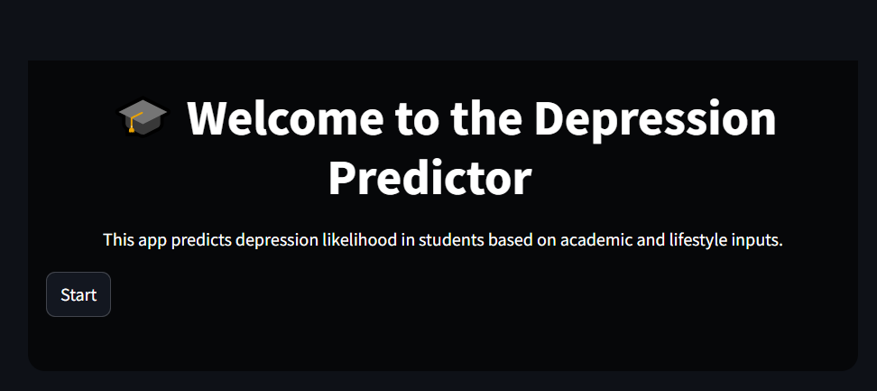
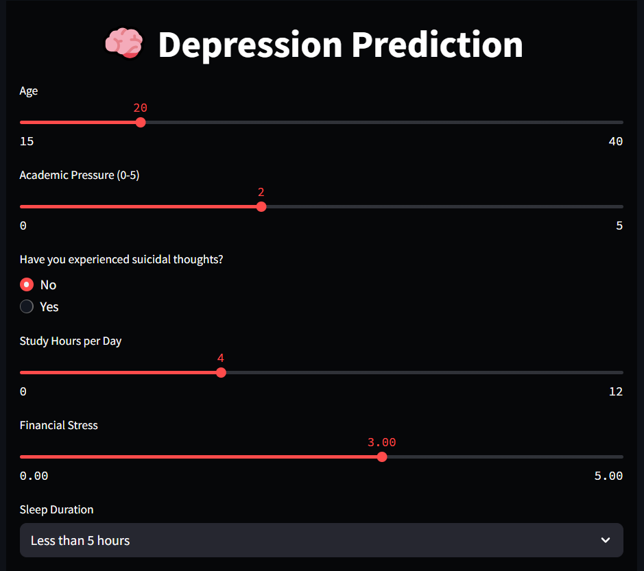
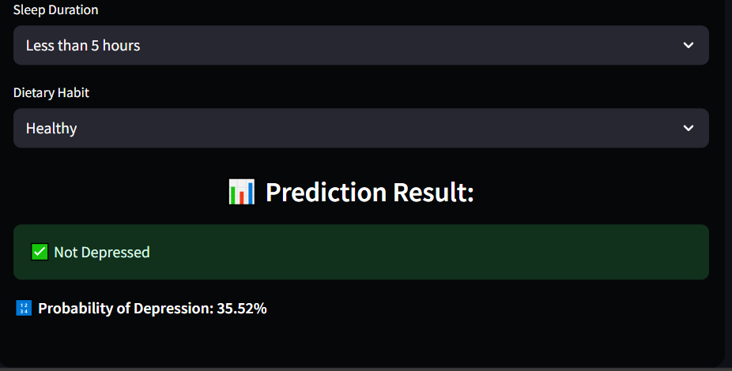

# 🎓 Student Depression Prediction 🎯

This project predicts the likelihood of depression in students based on various input features using **Logistic Regression**. The model was trained after performing **Exploratory Data Analysis (EDA)**, **data preprocessing**, **feature standardization**, and **dimensionality reduction (PCA)**. The final solution is deployed using **Streamlit** for a simple and interactive user experience.

---

## 🔍 Project Overview

- **Goal**: Predict student depression levels using survey and behavioral data.
- **Model Used**: Logistic Regression
- **Accuracy Achieved**: **83%** (with Standardization + PCA)
- **Deployment**: Web-based application using Streamlit

---

## 📊 Workflow Summary

1. **EDA (Exploratory Data Analysis)**  
   - Data cleaning, visualization, and correlation analysis  
   - Identification of key features affecting mental health

2. **Preprocessing**  
   - Handling missing values  
   - Label encoding and feature engineering  
   - Standardization (StandardScaler)

3. **Dimensionality Reduction**  
   - Applied PCA to reduce feature space while preserving variance

4. **Model Training**  
   - Logistic Regression  
   - 83% accuracy after PCA and standardization

5. **Deployment**  
   - Built a user-friendly interface with Streamlit  
   - Allows users to input data and get real-time predictions

---

## 🧠 Tech Stack

- **Python**
- **Pandas, NumPy**
- **Jupyter**
- **Matplotlib, Seaborn**
- **Scikit-learn**
- **Joblib**
- **Streamlit**

---
## Images




## ✅ Results
Logistic Regression Accuracy: 83%

Improved performance with PCA and StandardScaler

Provides quick and reliable predictions based on user input

---

## 🚀 How to Run the App Locally

1. **Clone the Repository**
   ```bash
   git clone https://github.com/yourusername/student-depression-predictor.git
   cd student-depression-predictor

